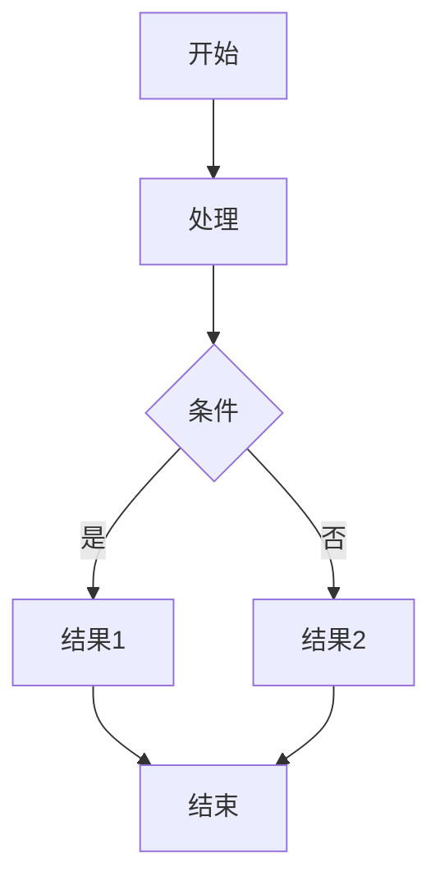

# Fly Markdown 实时预览器

一个功能强大的 Markdown 实时预览器，支持多种高级功能，如代码高亮、数学公式、图表等。

## 功能特性

- ✅ 实时预览
- ✅ 暗黑模式
- ✅ 代码高亮
- ✅ 数学公式（KaTeX）
- ✅ Mermaid 图表
- ✅ ECharts 图表
- ✅ 任务列表
- ✅ 脚注
- ✅ 表格
- ✅ 代码块
- ✅ 文档大纲
- ✅ 文件管理
- ✅ 快照时光机
- ✅ 多种导出格式（PDF、Word、图片、HTML）

## 技术栈

- React 19
- Vite 8
- Tailwind CSS 4
- CodeMirror 6
- Marked
- DOMPurify
- Highlight.js
- KaTeX
- Mermaid
- ECharts
- JSON5

## 安装

1. 克隆项目

```bash
git clone <repository-url>
cd fly-markdown-preview
```

2. 安装依赖

```bash
npm install
```

## 运行

### 开发模式

```bash
npm run dev
```

### 构建生产版本

```bash
npm run build
```

### 预览生产版本

```bash
npm run preview
```

## 目录结构

```
fly-markdown-preview/
├── src/
│   ├── components/         # 组件目录
│   ├── utils/              # 工具函数
│   │   └── markdownUtils.js  # Markdown 处理工具
│   ├── styles/             # 样式文件
│   │   └── index.css       # 主样式文件
│   ├── App.jsx             # 主应用组件
│   └── main.jsx            # 应用入口
├── public/                 # 静态资源
├── index.html              # HTML 入口
├── vite.config.js          # Vite 配置
├── tailwind.config.js      # Tailwind CSS 配置
├── postcss.config.js       # PostCSS 配置
├── package.json            # 项目配置
└── README.md               # 项目说明
```

## 使用说明

1. **编辑 Markdown**：在左侧编辑器中输入 Markdown 内容
2. **实时预览**：右侧会实时显示渲染结果
3. **切换模式**：点击工具栏中的「分屏」或「仅预览」按钮切换视图模式
4. **暗黑模式**：点击工具栏中的「主题」按钮切换暗黑模式
5. **文档大纲**：点击工具栏中的「大纲」按钮查看文档结构
6. **插入格式化内容**：使用工具栏中的按钮快速插入格式化内容
7. **导出文件**：点击「下载 MD」按钮下载 Markdown 文件，或点击「更多导出」选择其他格式
8. **文件管理**：使用左侧文件面板管理 Markdown 文件

## 快捷键

- **Ctrl+B**：加粗
- **Ctrl+I**：斜体
- **Ctrl+K**：超链接
- **Ctrl+E**：行内代码

## 示例

### 代码块

```javascript
function hello() {
  console.log('Hello, world!');
}
```

### 数学公式

行内公式：$E=mc^2$

块级公式：

$$
\int_0^1 x^2 dx = \frac{1}{3}
$$

### Mermaid 图表



### ECharts 图表

```echarts
{
  title: {
    text: '示例图表'
  },
  tooltip: {},
  xAxis: {
    data: ['Mon', 'Tue', 'Wed', 'Thu', 'Fri', 'Sat', 'Sun']
  },
  yAxis: {},
  series: [{
    name: '销量',
    type: 'bar',
    data: [5, 20, 36, 10, 10, 20, 5]
  }]
}
```
